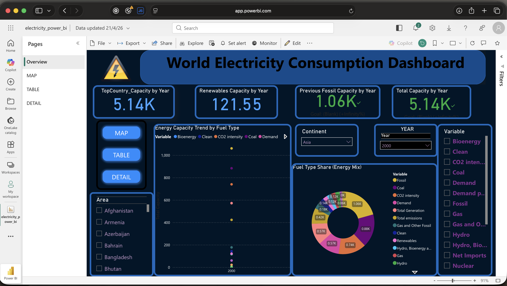
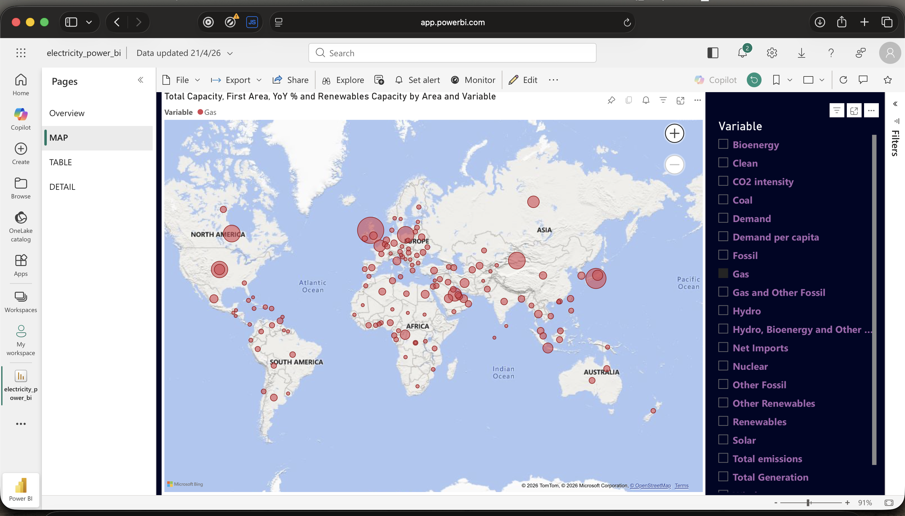
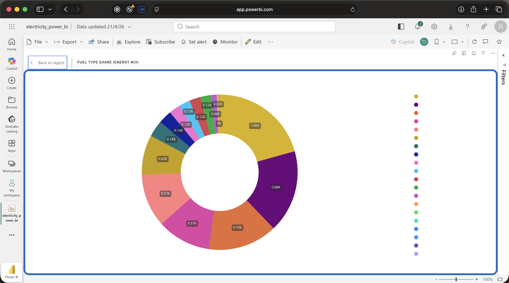

# ⚡ Electricity Generation Analysis Dashboard

A comprehensive **Power BI dashboard project** analyzing global electricity generation trends across countries, energy sources, and time.

---

## 📊 Dashboard Preview

---

## 🚀 Project Overview

This project focuses on analyzing global electricity generation data to uncover patterns, trends, and insights using **Power BI**.

### 🔍 Key Objectives:

* Analyze electricity generation across countries
* Identify year-wise trends
* Compare renewable vs non-renewable sources
* Build an interactive dashboard for insights

---

## 📈 Key Insights

* 🌍 Significant variation in electricity generation across regions
* ⚡ Developed countries show higher consumption patterns
* 📉 Increasing shift towards renewable energy sources
* 📊 Year-wise trends reveal growth and fluctuations in demand

---

## 📊 Power BI Dashboard

Due to GitHub file size limitations, download the dashboard here:

👉 [Download & Explore Dashboard](PASTE_YOUR_GOOGLE_DRIVE_LINK_HERE)

⚠️ **Note:** This file must be opened using **Power BI Desktop**.
(Google Drive preview will not display the dashboard)

---

## 📂 Project Files

* 📄 Electricity Generation Analysis Report (PDF)
* 📊 Dataset (CSV)
* 📈 Power BI Dashboard (.pbix via Google Drive)

---

## 🛠️ Tools & Technologies

* Power BI
* DAX (Data Analysis Expressions)
* Power Query
* CSV Dataset

---

## 📌 Features of Dashboard

* KPI Cards (Total, Average, Max Generation)
* Country-wise Bar Charts
* Year-wise Trend Analysis (Line Chart)
* Source-wise Distribution (Pie Chart)
* Interactive Filters & Slicers

---

## 📚 Dataset Details

* Global electricity generation dataset
* Includes:

  * Country / Region
  * Year
  * Energy Category
  * Subcategory
  * Consumption Value

---

## 🎯 Conclusion

This project demonstrates how **Power BI transforms raw energy data into actionable insights**, helping understand global electricity trends and supporting data-driven decision-making.

---

## 🔗 Connect with Me

📎 LinkedIn Project:
https://www.linkedin.com/posts/jyotirmay-sahoo-918a10304_powerbi-dataanalytics-datavisualization-ugcPost-7452412528866795520-N2NA

---

⭐ If you like this project, feel free to star the repository!
